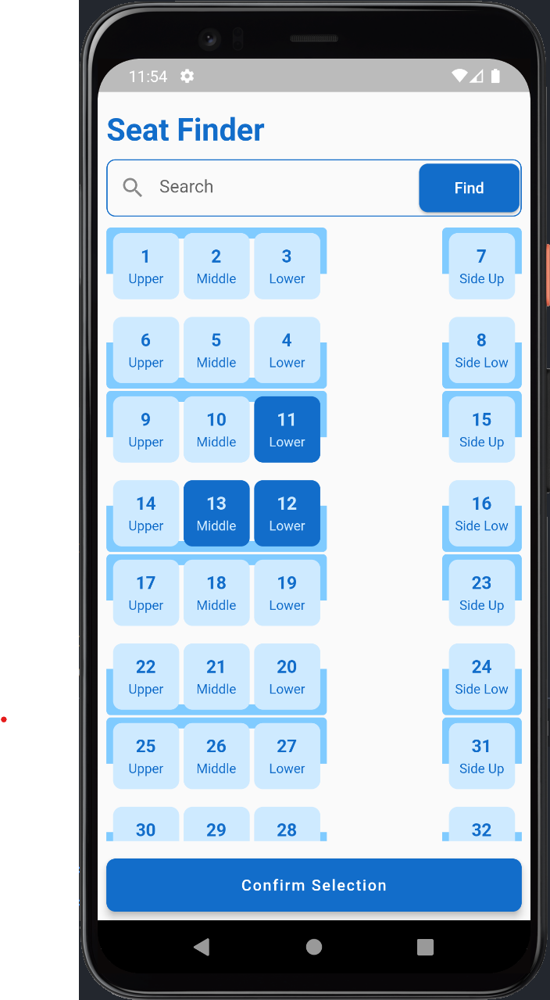
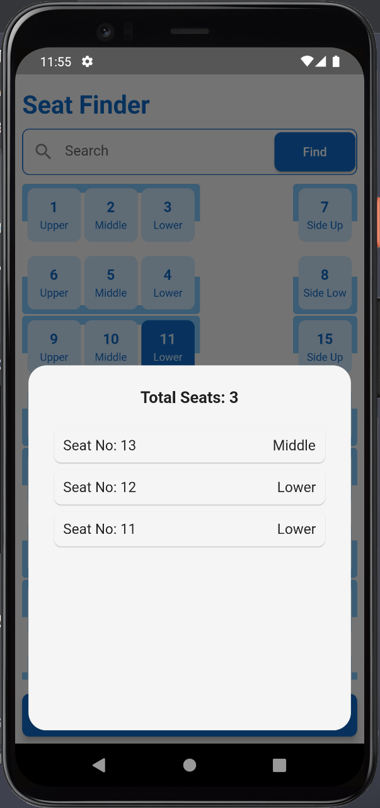

# Seat Finder App

The Seat Finder App is a Flutter application that allows users to view cabin layouts, search for specific seats, and select seats interactively. It utilizes the `provider` package for state management and provides an intuitive and user-friendly interface to browse and select seats efficiently.

## Methodology

The Seat Finder App is built using the Flutter framework, which is a popular open-source UI software development kit created by Google. The app follows a single-screen architecture, providing users with a seamless experience while exploring and selecting seats.

Key components of the methodology used in the app:

- Flutter Framework: The app is developed using the Flutter framework, which offers a rich set of pre-designed widgets and a fast, expressive, and flexible way to build user interfaces.

- Provider Package: For state management, the app utilizes the `provider` package. The `SelectionButtonProvider` class is used to manage selected seats and notify the UI of any changes.

- Custom Clipper: The app employs custom clippers (`MyCustomCliperFromTop` and `MyCustomCliperFromBottom`) to create unique shapes for different sections of the cabin layout.

## Screenshots




## How to Run

To run the Seat Finder App on your local machine, follow these steps:

1. Ensure you have Flutter installed on your system. If not, follow the installation instructions in the Flutter documentation: https://flutter.dev/docs/get-started/install

2. Clone this repository to your local machine using the following command:

```bash
git clone https://github.com/your_username/seat_finder_app.git
```

3. Navigate to the project directory:
   
```bash
cd seat_finder_app
```

4. Run the app on an emulator or connected device:

```bash
flutter run
```
Ensure that you have an emulator set up or a physical device connected via USB with debugging enabled.
