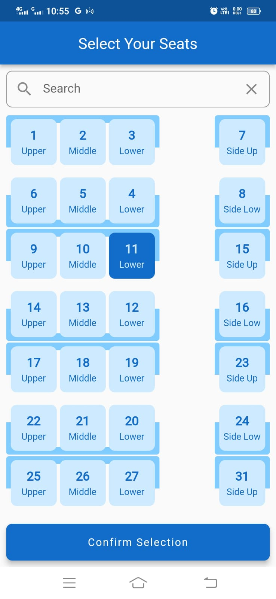
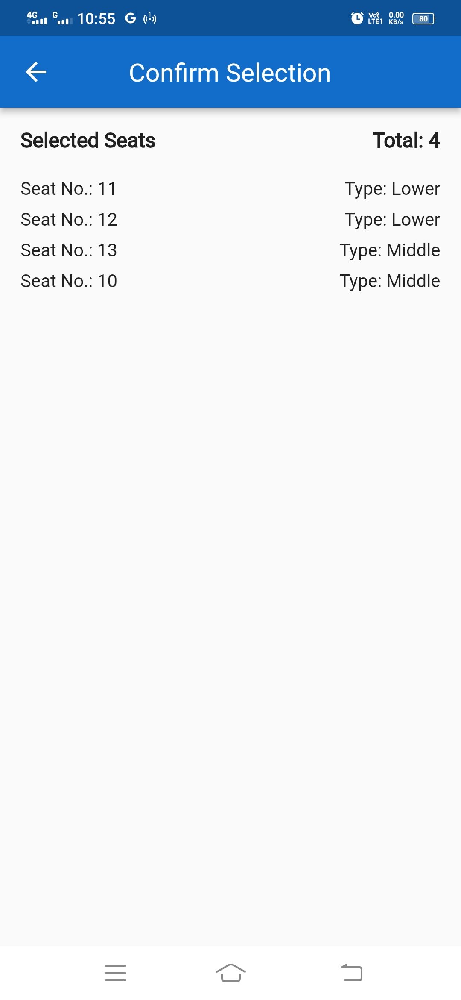

# Seat Selection App

The Seat Selection App is a Flutter application that allows users to select seats in a cabin-like environment. It provides an interactive interface where users can choose seats and see their selections visually.

## Features

- Display of cabin-like layout with seats arranged in rows
- Seat selection by tapping on individual seats
- Visual indication of selected seats
- Scrollable view to navigate through the cabin
- Search functionality to highlight specific seats

## Screenshots

## Technologies Used

- Flutter: A cross-platform framework for building mobile applications
- Provider: A state management library for managing application state
- Dart: The programming language used for developing Flutter applications

